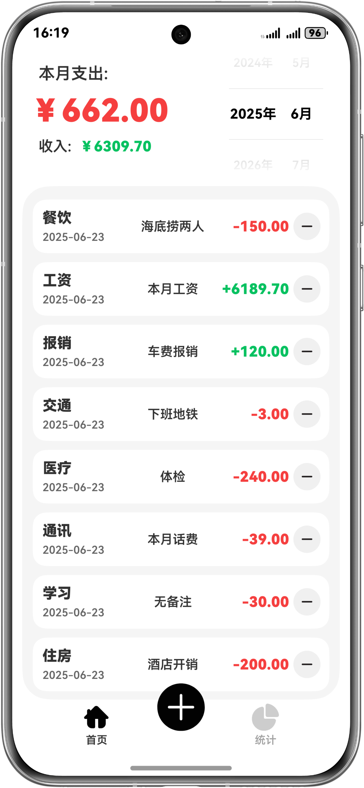
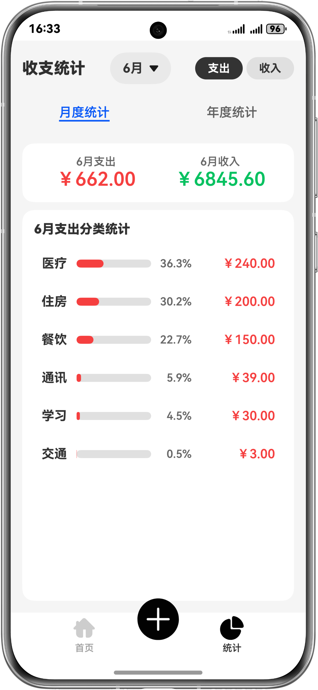
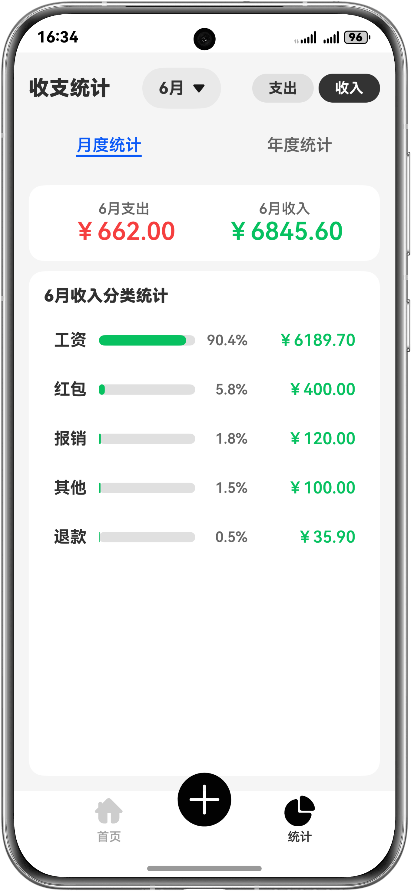

# 鸿蒙轻量级记账应用

一个基于HarmonyOS的轻量级记账应用，通过简单直观的界面帮助用户记录日常收支。

## 应用截图

| | |
|:-------------------------:|:-------------------------:|
|  |  |
|  |  |

## 功能特点

- 支持收入和支出记录
- 多种收支类型分类
- 直观的图标界面
- 流畅的交互动画
- 便捷的数据管理

## 技术栈

- HarmonyOS API 12+
- ArkTS
- Stage模型
- 关系型数据库 